## Tangcay

#### Framework: Svelte JS

#### Module: Document Request

#### 🚀 Installation

Prerequisites
Make sure the following are installed on your machine:

- [Node 18.13.0 or higher](https://nodejs.org/en) — required to run Svelte
- [Git](https://git-scm.com/) — required to clone the repository

Setup (Windows PowerShell)
To replicate and run this project, follow these steps:

## Install Node.js (LTS)
winget install OpenJS.NodeJS.LTS

## (Optional) Install and use Node Version Manager
nvm install lts

nvm use lts

## Clone the repository
git clone https://github.com/myouimyoui/document-request-page.git

## Navigate into the project directory
cd document-request-page

## Install dependencies
npm install

## Start the development server
npm run dev -- --open

### Branch
```bash
git checkout -b feature/pwa-ready
```

### Files Added / Modified

| File | Purpose |
|------|---------|
| `static/manifest.json` | Web App Manifest with ADDU branding, icons, screenshots |
| `static/service-worker.js` | Custom Service Worker — Cache First for shell/images, Network First for API routes |
| `static/offline.html` | Offline fallback page shown when no cache & no network |
| `src/routes/+layout.svelte` | Root layout — manifest link, PWA meta tags, SW registration |

### AI Tools:

1. Gemini (Pro) - PWA prompt creation
2. Claude - Creating PWA website

### Prompt:

Gemini Prompt:
Help me Create a PWA prompt for my current svelte.js project

Claude (Anthropic) Prompt:
Best if you are starting from scratch and want a robust, standards-compliant PWA structure. "I am building a Progressive Web App using SvelteKit and Vite. Act as an expert frontend engineer. Help me configure vite-plugin-pwa for an offline-first experience. I need a manifest configuration that includes maskable icons, a theme color of [Insert Color], and a service worker strategy for 'Cache First' assets. Please provide the vite.config.js setup and a Svelte component that handles the beforeinstallprompt event with a custom UI." 

## AI Hallucinations / Errors Fixed Manually

| # | Hallucination / Error | Manual Fix Applied |
|---|----------------------|-------------------|
| 1 | AI used import { count } from './store' and tried to update it with count++ | Replaced with $state rune or used the count.update(n => n + 1) syntax for writable stores to ensure reactivity. |
| 2 | AI tried to access document or window at the top level of a script tag | Wrapped the logic in onMount or used the browser check from $app/environment to prevent SSR crashes. |
| 3 | AI suggested putting a Service Worker in static/ and manually registering it |Moved service-worker.js to src/ and let SvelteKit handle the registration and hashed asset manifest automatically. |
| 4 | AI suggested export let data for a child component | Changed to let { ...props } = $props() (Svelte 5) to follow the new component communication pattern. |
| 5 | AI used target: '#root' in a config file, but SvelteKit uses %sveltekit.body% in app.html | Restored the template tags in app.html to allow the engine to inject the app correctly. |
| 6 | AI tried to fetch API data using a relative path /api/user inside onMount | Moved the fetch to a +page.server.js load function to benefit from server-side execution and avoid CORS/relative path issues. |
| 7 | AI used adapter-auto for a project requiring a Node.js VPS | Explicitly swapped to @sveltejs/adapter-node in svelte.config.js to ensure the build generates a runnable index.js server. |
| 8 | AI suggested position: absolute for the Sidebar, causing it to scroll away | Applied position: fixed with height: 100vh and used a grid-template-columns on the parent to prevent content overlap |
| 9 | AI used bind:value on a prop directly, which is now deprecated/warned | Switched to the bindable() rune to explicitly allow two-way binding for that specific property. |
| 10 | AI hardcoded VITE_API_URL in the frontend code | Moved sensitive keys to .env and imported via $env/static/public to ensure they are properly injected during the Vite build process. |


#### Screenshots

## Alumni Screens
### Login Screen
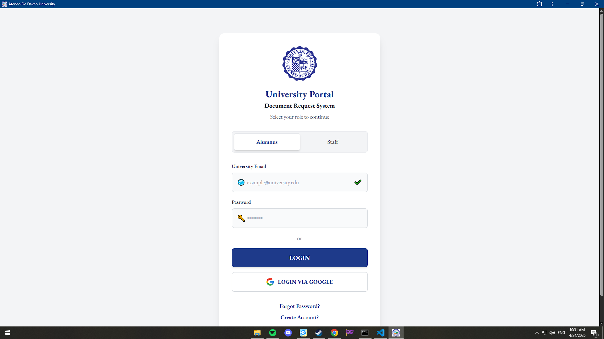
### Alumni Dashboard
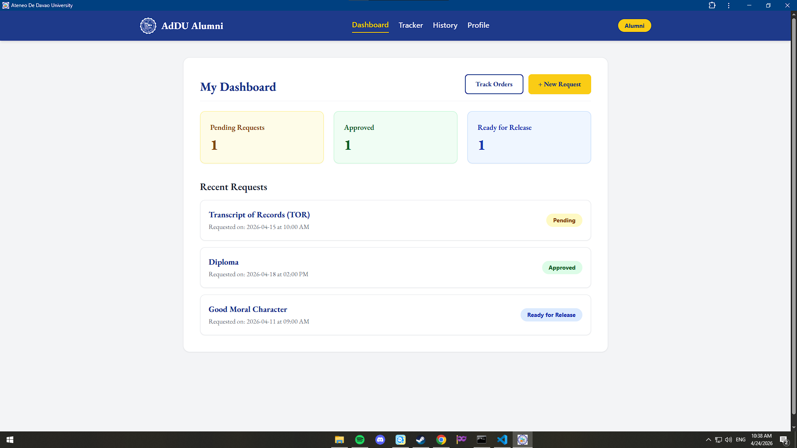
### Alumni Request Document
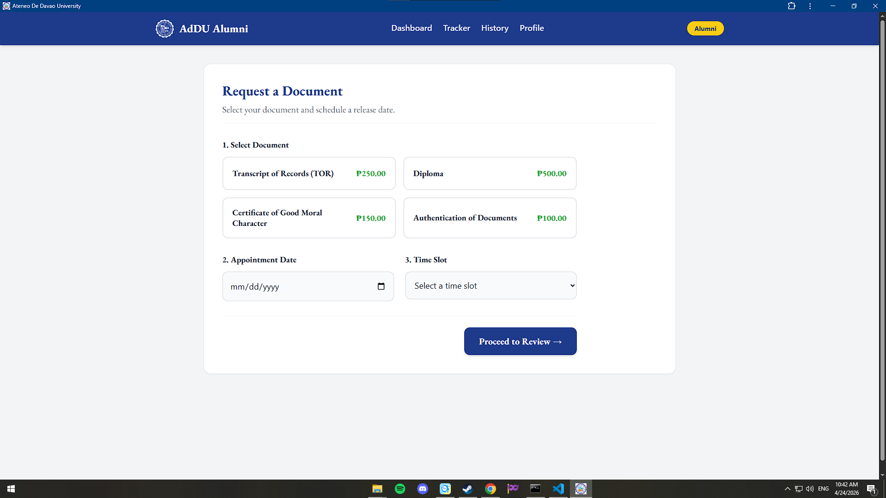
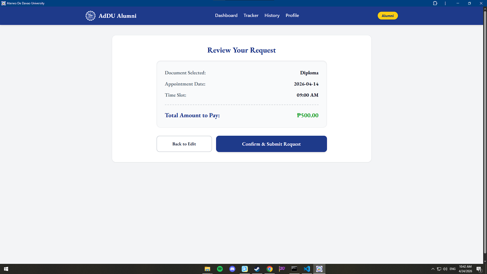
### Alumni Tracker
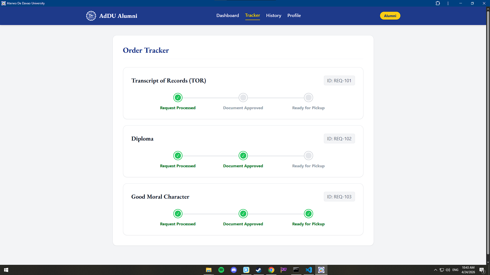
### Alumni History
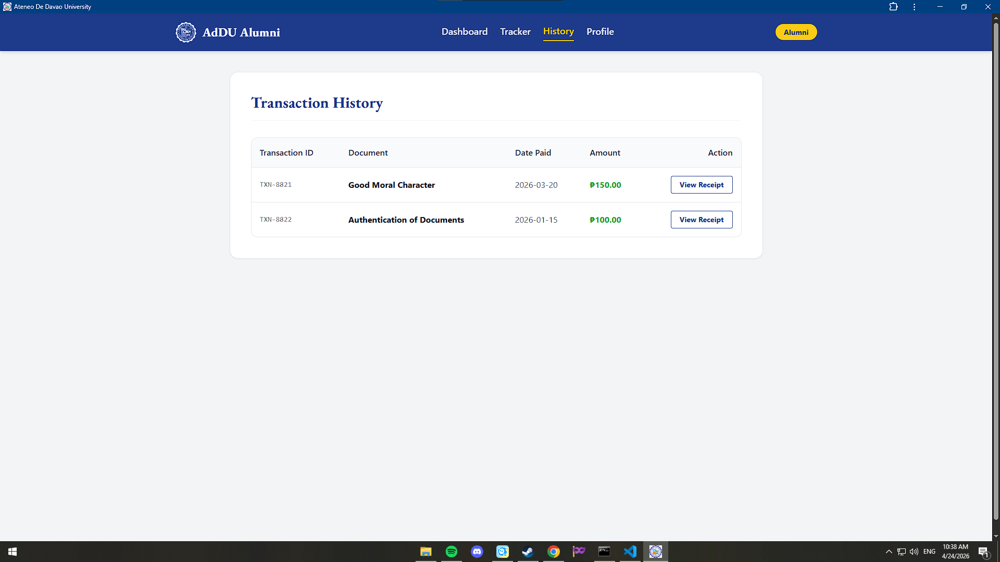
### Alumni Profile
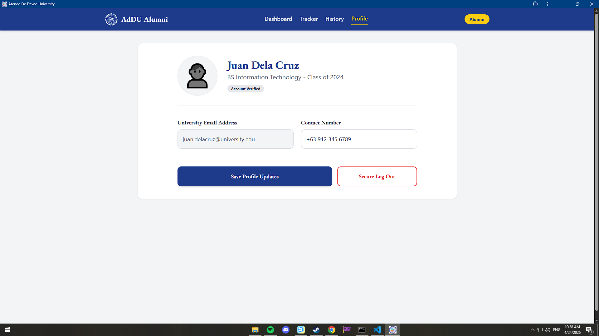

## Staff Screens
### Login Screen
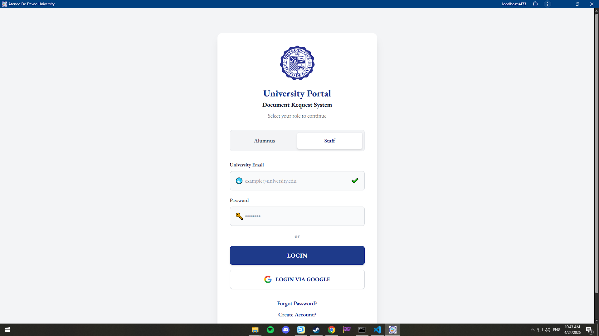
### Staff Dashboard
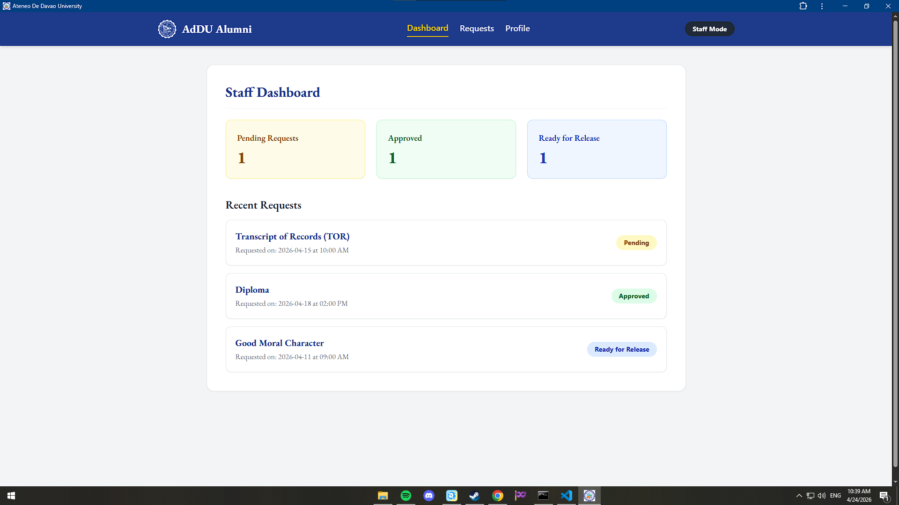
### Manage Request
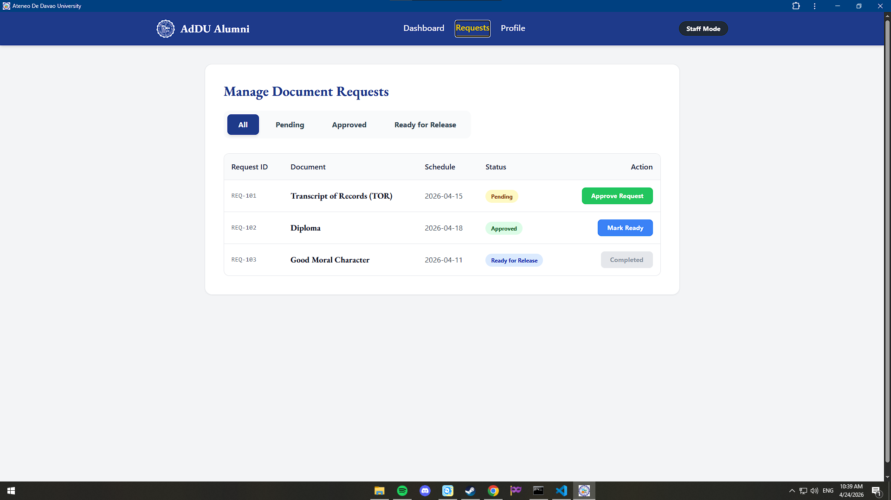
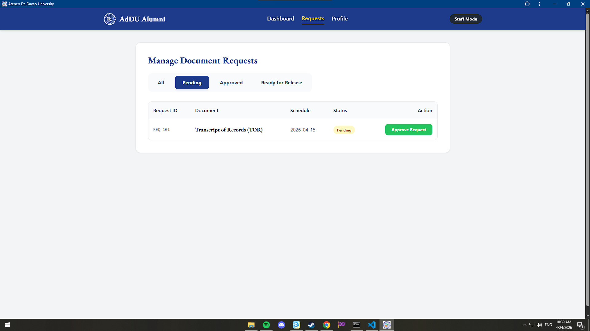
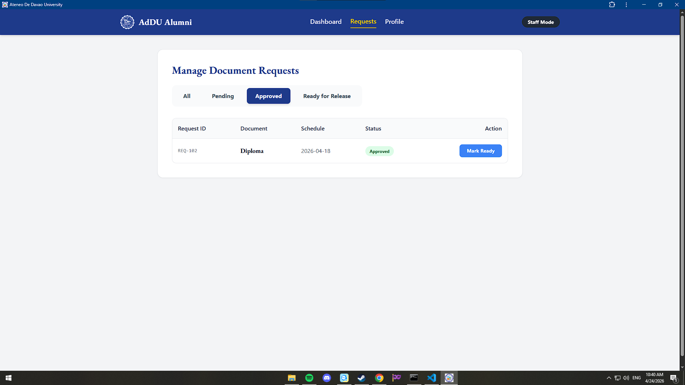
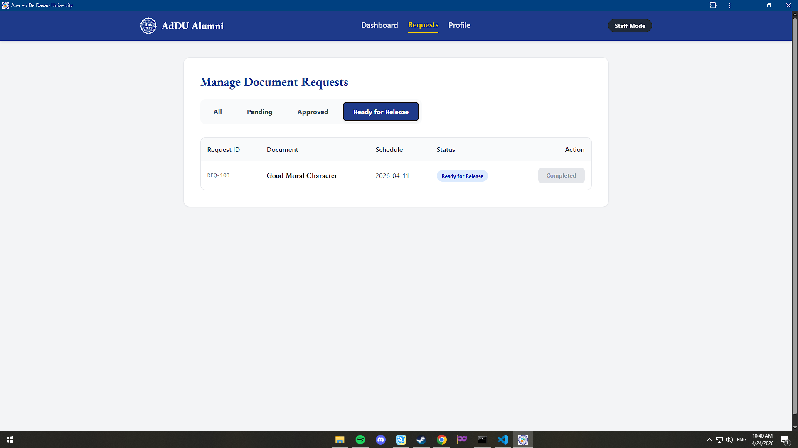
### Staff Profile
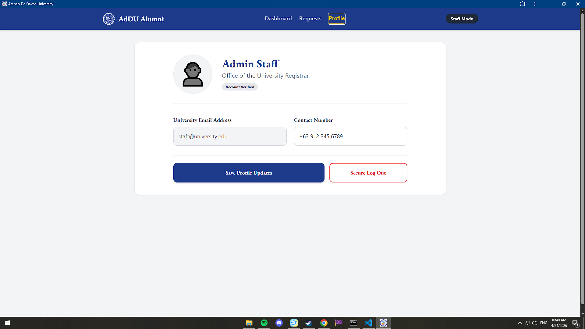