## Tangcay, Aaron Ace P.

#### Framework: Svelte JS

#### Module: Document Request

#### Installation

To replicate and run this project follow the following steps using Windows Powershell:

```bash
winget install OpenJS.NodeJS.LTS
nvm install lts
nvm use lts
git clone https://github.com/myouimyoui/document-request-page.git
cd document-request-page
npm install
npm run dev -- --open
```

### AI Tools:

1. Chat GPT
2. Gemini (Pro)

### Prompt:

GPT prompt:
Create a prompt that is using Svelte.js follow the flow and don't add anything or unnecessary things other what's inside the unversity portal document request system pdf file

Gemini prompt:
Create a Svelte.js mobile UI high-fidelity prototype for an University Portal Document Request system that follows this flow: Alumni Login Page where an alumnus logs in using their university account to track appointments and requests, supporting organized scheduling and reduced waiting time; Alumni Dashboard displaying all pending, approved, and ready document requests with tracking capability; Alumni Profile showing account information; Document Request Selection Page displaying available document requests; Appointment Selection Page showing all requestable documents with their prices for complete information; Request Review Page summarizing the request including document, date, time, and price for confirmation; Order Tracker allowing real-time tracking of request status (processed, approved, ready for release); Transaction History displaying payment records with accurate dates, amounts, full details, and access to digital and printable receipts; Staff Login Page allowing staff to log in using university email to track requests; Staff Dashboard showing all pending, approved, and ready requests upon login; Staff Profile allowing viewing and updating of account information; and Status Filter Page enabling staff to filter document requests by status for easier approval and organized workflow. Use color #1E3A8A and #FFFFFF for the font use EB Garamond

#### Screenshots

## Alumni Screens
### Login Screen
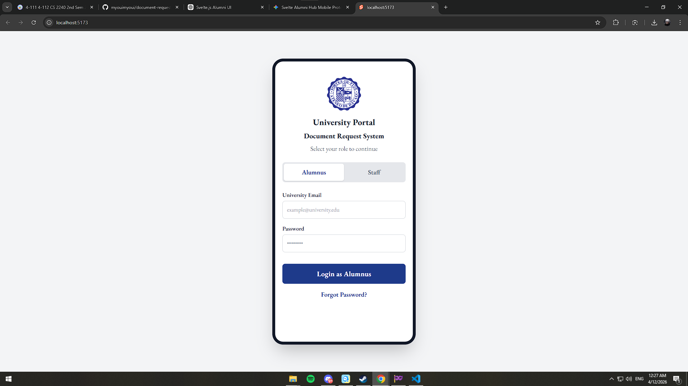
### Alumni Dashboard
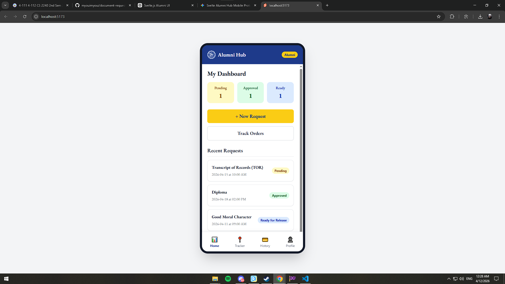
### Alumni Request Document

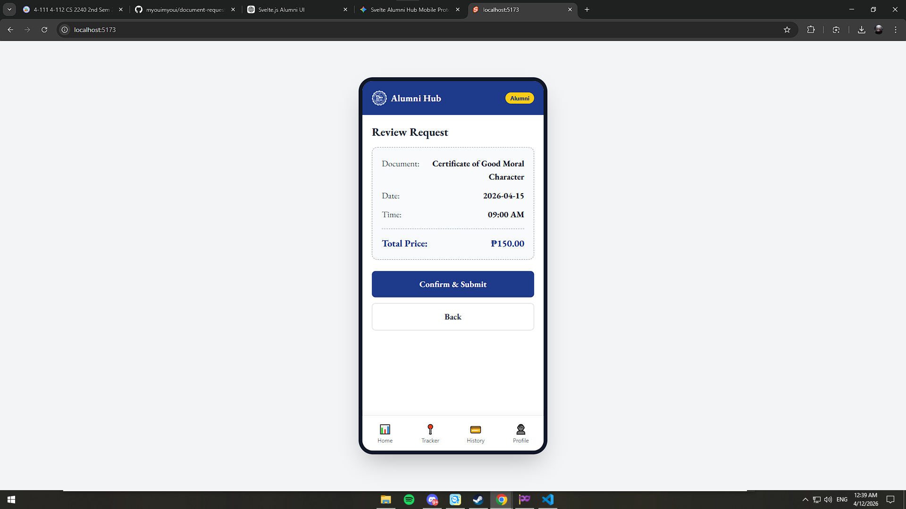
### Alumni Tracker
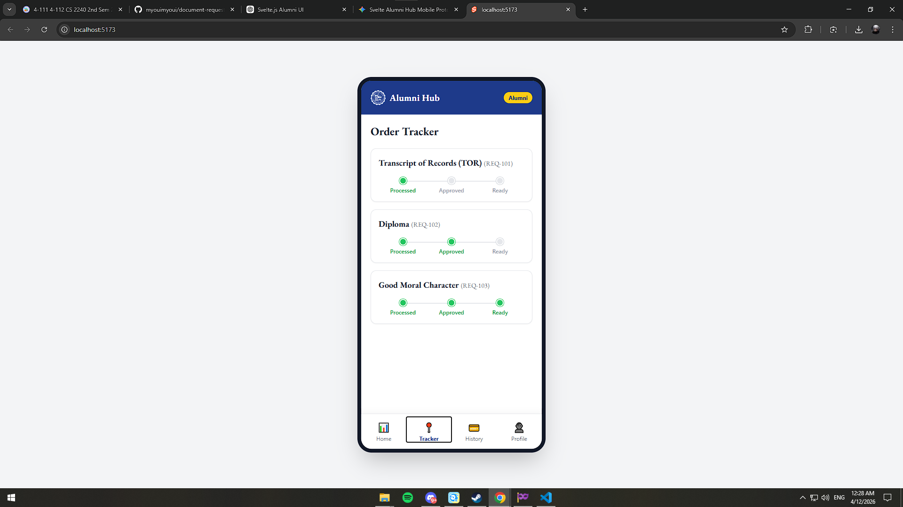
### Alumni History
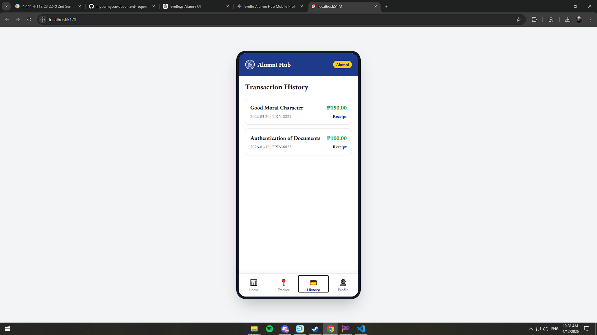
### Alumni Profile
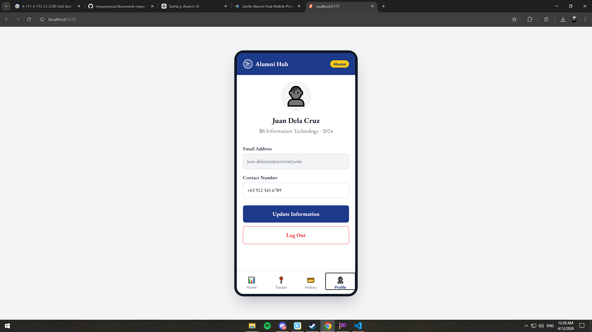

## Staff Screens
### Login Screen
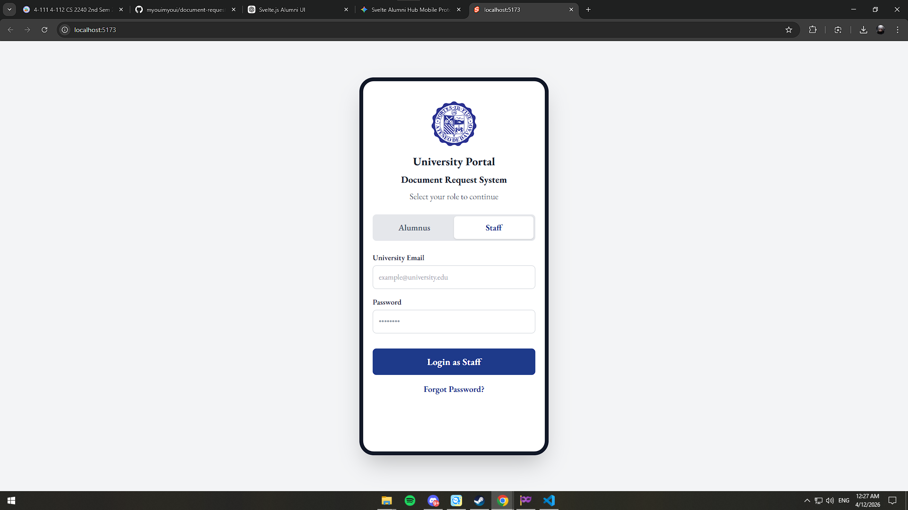
### Staff Dashboard

### Manage Request
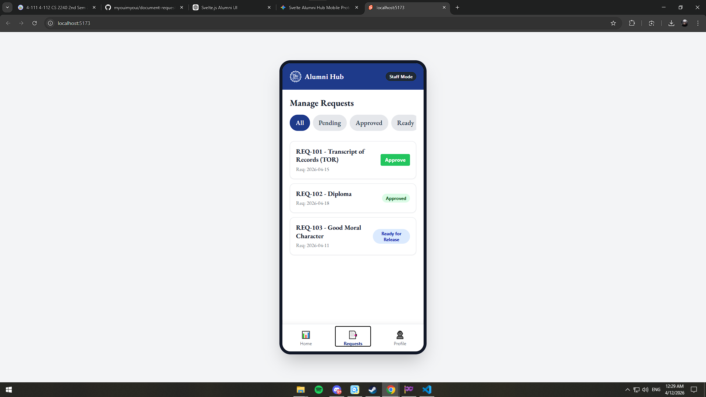
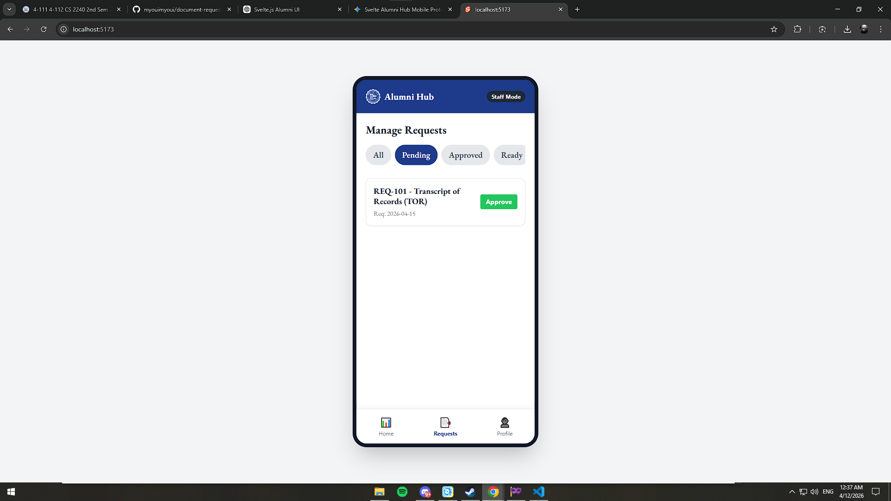
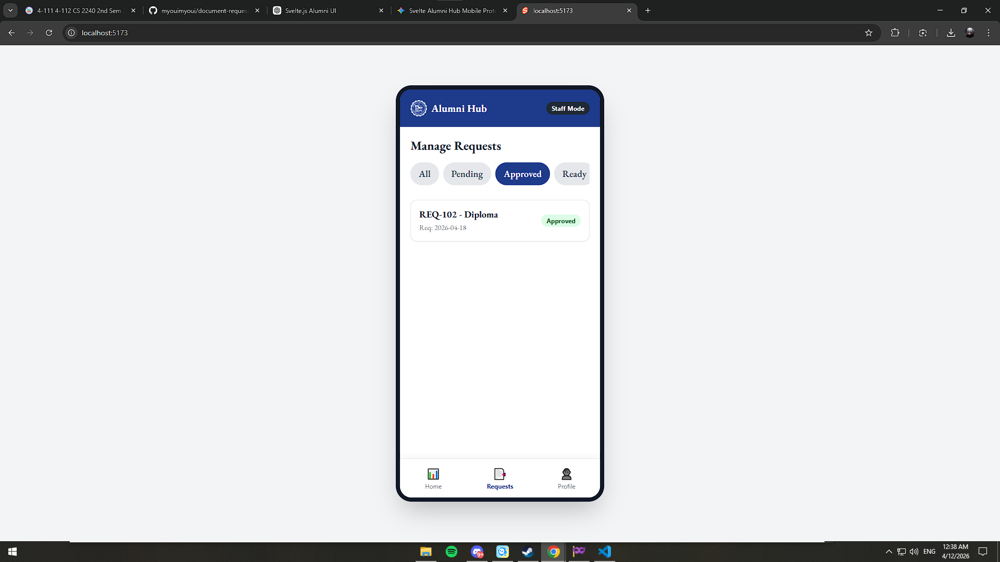
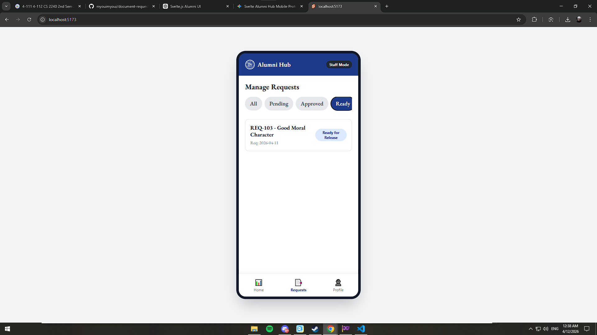
### Staff Profile
